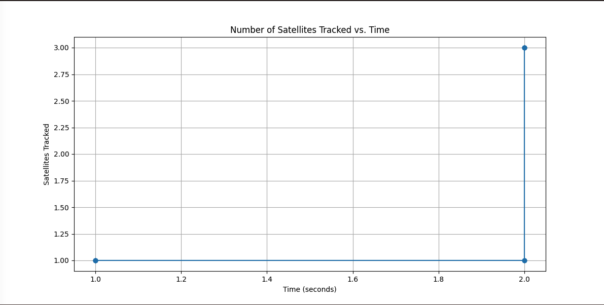

# NMEA Parser
***********
1) Parses the NMEA log through different interfaces ie log file, UART, Wifi, BLE etc.
2) Uses regular expression for parsing the logs
3) Matplotlib for creating static, animated, and interactive visualizations.

### Tested python version
```
    python3.10
```  

### Install the packages
```
    python3.10  -m pip install -r requirements.txt
```

## Help command
```casbin
python main.py -h    
usage: main.py [-h] [--inlet {ble,log,uart,wifi}] [--from-env FROM_ENV]

A simple command line inlet for nvme parser module to validate and pretty-print objects.

options:
  -h, --help            show this help message and exit
  --inlet {ble,log,uart,wifi}, -i {ble,log,uart,wifi}
  --from-env FROM_ENV, -e FROM_ENV
                        List of all the options that needs to be read from the OS environment.

```

## Run the app using main.py 
```
 python main.py -i log        
Log file mode /Users/disenchitilapilly/repo/pythonProject/NMEA-Parser/data/stce_nmea_log.txt
{'Satellites Tracked': [1, 1, 1, 1, 1, 1, 1, 1, 3, 3, 3, 3, 3, 3],
 'Timestamp': [1, 1, 1, 1, 1, 2, 2, 2, 2, 2, 2, 2, 2, 2]}

```

## Sample output

